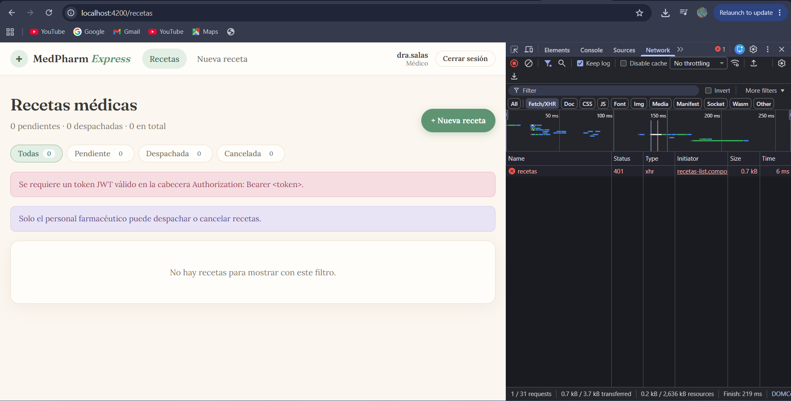

# MedPharm Express — Laboratorio 13 (IF0009 Desarrollo de Software IV)

Plataforma full-stack de gestión de recetas médicas y despacho de farmacia.

| Capa | Tecnología |
|---|---|
| Backend | Spring Boot 3.4, Java 17+, Spring Security + JWT (JJWT), Spring Data JPA, H2 en memoria |
| Frontend | Angular 19 Standalone, Formularios Reactivos (FormGroup/FormArray), Signals, Interceptor HTTP, Guard de rutas |

```
IF0009-Lab13-c5l189/
├── medpharm-backend/    # API REST (Spring Boot 3)
├── medpharm-frontend/   # SPA (Angular 19 standalone)
├── docs/                # Evidencia de la Parte 3 (captura del error 401)
└── README.md
```

## Cómo ejecutarlo

### 1. Backend (puerto 8080)

Requisitos: JDK 17 o superior y Maven (o abrir `medpharm-backend` en IntelliJ y ejecutar `MedpharmBackendApplication`).

```powershell
cd medpharm-backend
mvn spring-boot:run
```

- Consola H2: <http://localhost:8080/h2-console> — JDBC URL `jdbc:h2:mem:medpharmdb`, usuario `sa`, sin contraseña.
- Los scripts `schema.sql` y `data.sql` (en `src/main/resources`) crean las tablas y cargan datos de ejemplo al arrancar.

### 2. Frontend (puerto 4200)

Requisitos: Node 20/22 y Angular CLI 19.

```powershell
cd medpharm-frontend
npm install
npx ng serve
```

Abrir <http://localhost:4200>.

### Usuarios de prueba

| Usuario | Contraseña | Rol | Puede |
|---|---|---|---|
| `dra.salas` | `medico123` | MEDICO | Emitir recetas, ver el listado |
| `dr.vargas` | `medico123` | MEDICO | Emitir recetas, ver el listado |
| `farma.rojas` | `farma123` | FARMACEUTICO | Ver el listado, despachar o cancelar recetas |

## API REST

| Método | Endpoint | Descripción | Acceso |
|---|---|---|---|
| POST | `/api/v1/auth/login` | Autentica y devuelve `{ token, username, rol }` | Público |
| GET | `/api/v1/recetas` | Lista todas las recetas | Autenticado |
| GET | `/api/v1/recetas/estado/{estado}` | Filtra por `PENDIENTE`, `DESPACHADA` o `CANCELADA` | Autenticado |
| POST | `/api/v1/recetas` | Registra una receta con sus detalles (valida stock) | MEDICO |
| PATCH | `/api/v1/recetas/{id}/estado` | Cambia el estado (`{ "estado": "DESPACHADA" }`) | FARMACEUTICO |
| GET | `/api/v1/medicamentos` | Catálogo para poblar los selectores | Autenticado |

Los errores se devuelven en formato **RFC 7807** (`application/problem+json`) desde un `@RestControllerAdvice` central
(`400` validación, `401` credenciales, `404` no encontrado, `409` stock insuficiente o receta no modificable).

### Decisiones de diseño

- **Stock**: al crear una receta solo se *valida* que haya existencias suficientes; el inventario se **descuenta al despachar** (y se vuelve a validar en ese momento).
- **Roles**: el médico emite recetas y el farmacéutico las despacha/cancela, tal como describe el contexto de negocio. La regla vive en `SecurityConfig`.
- **Estados**: una receta solo puede pasar de `PENDIENTE` a `DESPACHADA` o `CANCELADA`; después queda cerrada.
- **Contraseñas**: se guardan con BCrypt en `data.sql`.

## Parte 3 — Depuración del error 401 (JWT + interceptor)

### Cómo reproducir la falla

1. Con backend y frontend corriendo, abrir `medpharm-frontend/src/app/app.config.ts`.
2. Comentar el registro del interceptor, dejando `provideHttpClient()` sin `withInterceptors`:

   ```ts
   // provideHttpClient(withInterceptors([authInterceptor])),
   provideHttpClient(),
   ```

3. Iniciar sesión y entrar a `/recetas`. El listado falla.
4. Abrir las herramientas de desarrollo → pestaña **Network** → petición `GET /api/v1/recetas` → verificar el estado **401 Unauthorized** y que en *Request Headers* **no** aparece `Authorization`.
5. Guardar la captura de pantalla como `docs/error_jwt_401.png`.
6. Restaurar la línea original del interceptor.



### Por qué el servidor rechazó la petición

El backend es **stateless**: no guarda sesiones, así que *cada* petición debe demostrar quién es el usuario. Eso se hace con la cabecera `Authorization: Bearer <token>`.

Sin el interceptor, `HttpClient` envía la petición **sin esa cabecera** (Angular nunca añade credenciales por sí solo, aunque el token ya esté guardado en `localStorage`). Dentro de Spring Boot ocurre esto:

1. `AuthTokenFilter` busca la cabecera `Authorization`, no encuentra token y deja el `SecurityContext` vacío.
2. Spring Security trata la petición como **anónima**.
3. La regla `anyRequest().authenticated()` de `SecurityConfig` deniega el acceso a `/api/v1/recetas`.
4. `ExceptionTranslationFilter` invoca el `authenticationEntryPoint` configurado, que responde **401 Unauthorized** (si no se configurara, Spring respondería 403 Forbidden por defecto).

**Nota sobre CORS / preflight.** Como el frontend (`:4200`) y la API (`:8080`) son orígenes distintos y la petición lleva la cabecera personalizada `Authorization`, el navegador envía antes una petición **OPTIONS** (preflight). Esa petición *nunca* incluye el token, por lo que si el servidor la exigiera autenticada la rechazaría y el navegador bloquearía la llamada real. Por eso `SecurityConfig` habilita CORS (`cors(Customizer.withDefaults())` con origen `http://localhost:4200` y cabecera `Authorization` permitida) y declara `OPTIONS /**` como público.

### Cómo lo resuelve el interceptor HTTP

`authInterceptor` (`src/app/interceptors/auth.interceptor.ts`) es un `HttpInterceptorFn` registrado con `provideHttpClient(withInterceptors([authInterceptor]))`. Para cada petición saliente hacia la API:

1. Lee el token con `AuthService.getToken()`.
2. Como `HttpRequest` es inmutable, **clona** la petición con `req.clone({ setHeaders: { Authorization: 'Bearer ' + token } })`.
3. Envía la copia con `next(...)`. El servidor ahora recibe el JWT, `AuthTokenFilter` lo valida (firma HMAC-SHA256 y expiración), carga el usuario y establece el `SecurityContext`, por lo que la petición pasa a `200 OK`.

Además, si la API responde 401 estando logueado (token vencido), el interceptor cierra la sesión y envía al usuario a `/login`.

## Commits semánticos

El historial sigue la convención `tipo(ámbito): descripción` (`chore`, `feat`, `docs`).
